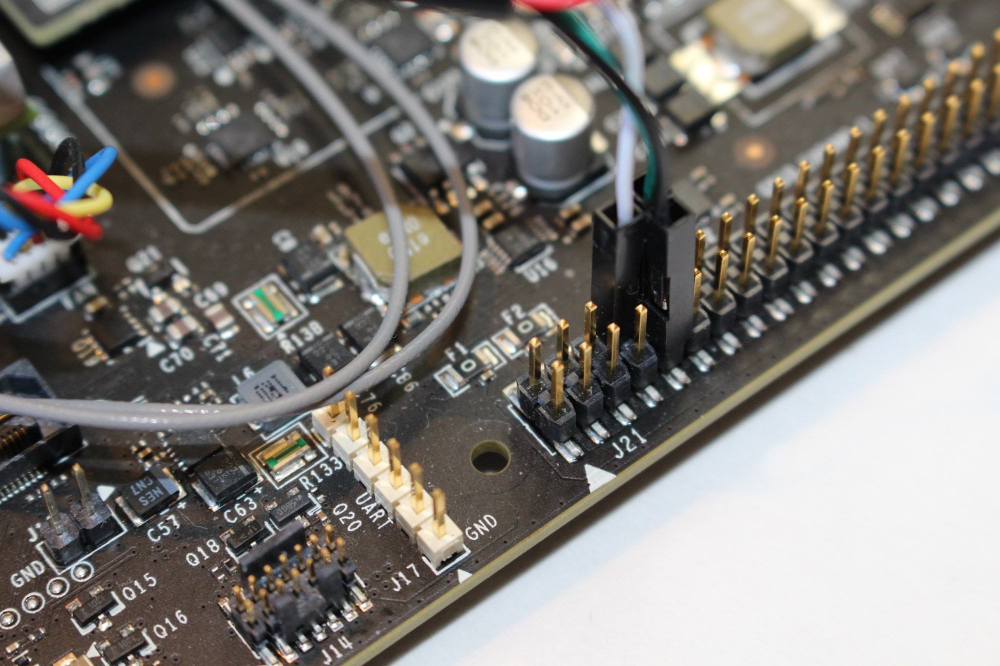

JAILHOUSE for NVIDIA Jetson TX2
===============================

This is the [Jailhouse hypervisor](https://github.com/siemens/jailhouse)
for the default **4.4** [Linux kernel provided by NVIDIA](https://developer.nvidia.com/embedded/linux-tegra)
for the [Jetson TX2 platform](https://developer.nvidia.com/embedded/buy/jetson-tx2-devkit).
The porting activity has been done in the context of the [HERCULES European project](http://hercules2020.eu).

Please, refer to the [original website](https://github.com/siemens/jailhouse)
for further information about Jailhouse or other platforms/kernel versions.


Linux kernel build & Installation
---------------------------------

For installing Jailhouse, a copy of the compiled Linux kernel with all object
files is needed, to be able of building the kernel module.
Additionally, you need to configure the kernel using the configuration
available in the ```kernel/config``` file.

Note that NVIDIA provides its own Linux kernel (not Vanilla).
The kernel sources are [available here](http://developer.download.nvidia.com/embedded/L4T/r28_Release_v2.0/BSP/source_release.tbz2).

Some scripts [available here](https://github.com/jetsonhacks/buildJetsonTX2Kernel)
allow to automatically download and build such kernel for the TX2 platform,
also fixing a few issues that prevent a successful build.

The hypervisor requires a contiguous piece of RAM for itself and each
additional cell. This currently has to be pre-allocated during boot-up.
On ARM platforms this is usually achieved by reducing the amount of memory seen
by the Linux kernel. You therefore need to modify the kernel boot arguments
adding ```mem=7808M vmalloc=512M``` (on TX2 this can be written inside the
```/boot/extlinux/extlinux.conf``` file).


Jailhouse build & Installation
------------------------------

Download/clone the source code of Jailhouse for TX2.

Jailhouse can be either cross-compiled (i.e., on a host machine) or built
natively (i.e. directly on the TX2 platform).

Cross-compilation can be done by installing an aarch64 cross-compiler (```sudo
apt install gcc-aarch64-linux-gnu``` on Ubuntu 16.04) and then typing:

    make ARCH=arm64 CROSS_COMPILE=aarch64-linux-gnu- KDIR=/path/to/compiled/kernel/ DESTDIR=/path/for/binaries install

You then have to transfer the content of the destination directory to the TX2
platform (e.g., by zipping the content, transferring the archive, and unzipping
the content on the target).

The native compilation is easier, and just requires to type the following command on the TX2:

    sudo make KDIR=/path/to/compiled/kernel/ install


Serial port assignment
----------------------

Usually, the serial port is assigned exclusively to the inmate, especially if
it does not run a full-fledged operating system capable of using more complex
hardware (e.g., a display). This is the case, for example, of the gic-demo
illustrated below, which prints its output directly on the serial console.

A FTDI USB cable can be used to physically connect the platform's serial
console to a host machine. The following picture shows how pins must be
connected on the platform side. More information about this connection is
[available here](http://www.jetsonhacks.com/2015/12/01/serial-console-nvidia-jetson-tx1/).
You can then install a serial terminal program on the host machine (e.g., Putty
or minicom), set a 115200 baudrate and connect to the board.

<p align="center">

</p>

Then, Linux must be prevented from starting a console on the serial
port. This can be done by removing the ```console=ttyS0,115200n8``` parameter
from the boot arguments (keep ```earlyprintk=uart8250-32bit,0x70006000
console=tty0``` as it is useful for interface initialization).
Since the ```cbootargs``` environment variable gets automatically overwritten
at each boot, the best way to remove such option is to change the ```bootcmd``
variable by typing

    setenv bootcmd setenv cbootargs root=/dev/mmcblk0p1 rw rootwait console=tty0 OS=l4t fbcon=map:0 net.ifnames=0 memtype=0 video=tegrafb no_console_suspend=1 earlycon=uart8250,mmio32,0x03100000 nvdumper_reserved=0x2772e0000 gpt tegraid=18.1.2.0.0 tegra_keep_boot_clocks maxcpus=6 boot.slot_suffix= boot.ratchetvalues=0.2.1 androidboot.serialno=0324617129741 bl_prof_dataptr=0x10000@0x277040000 sdhci_tegra.en_boot_part_access=1 \; run distro_bootcmd

    saveenv

    reset

After this change, Linux will not start the console on the serial port anymore.
The console will still be reachable through HDMI. Alternatively, before
disabling the serial port, you can assign a static IP to the platform by
appending to ```/etc/network/interfaces``` the needed information:

	auto eth0
	iface eth0 inet static
	address ...
	netmask ...
	gateway ...

When setting the static IP address, you may also want to add the DNS server in
```/etc/resolv.conf```.


Jailhouse usage
---------------

Once the boot arguments has been modified and the machine rebooted, to run the
hypervisor type:

	sudo sh -c 'echo 1 > /sys/kernel/debug/cpuidle_t210/fast_cluster_states_enable'
	sudo modprobe jailhouse
	sudo jailhouse enable jailhouse/configs/arm64/jetson-tx2.cell

Performance can be improved by setting the performance CPU frequency governor:

	sudo sh -c 'echo performance > /sys/devices/system/cpu/cpufreq/policy0/scaling_governor'


Jailhouse demonstration
-----------------------

Next, you can create a cell with a demonstration application as follows:

	sudo jailhouse cell create jailhouse/configs/arm64/jetson-tx2-demo.cell
	sudo jailhouse cell load jetson-tx2-demo jailhouse/inmates/demos/arm64/gic-demo.bin
	sudo jailhouse cell start jetson-tx2-demo

This application will program a periodic timer interrupt, measuring the jitter
and displaying the result on the console.

After creation, cells are addressed via the command line tool by providing
their names or their runtime-assigned IDs. You can obtain information about
active cells this way:

	jailhouse cell list

You can also obtain statistical information about the number of VM exists:

	jailhouse cell stats jetson-tx2-demo

Cell destruction is performed through the following command:

	sudo jailhouse cell destroy jetson-tx2-demo

Finally, the jailhouse hypervisor can be disabled by typing:

	sudo jailhouse disable


ERIKA3 RTOS
-----------

Please, refer to [the ERIKA wiki](http://www.erika-enterprise.com/wiki/index.php?title=Nvidia_Jetson_TX2)
for instructions about running the ERIKA3 RTOS on top of Jailhouse on the TX2
platform.


